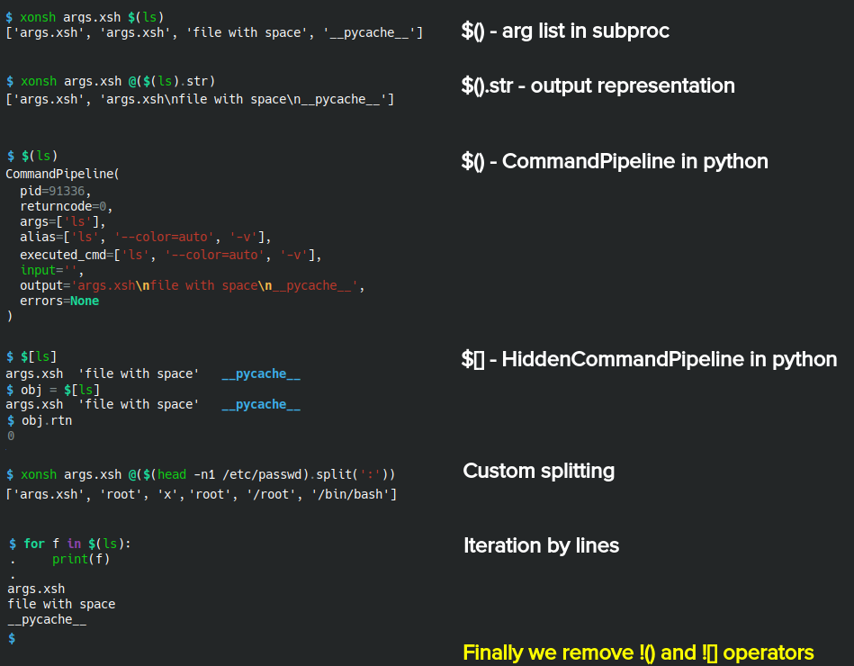

.. list-table::

  * - XEP:
    - 2
  * - Title:
    - Xonsh Operators Proposal - Single operator approach
  * - Author:
    - anki-code
  * - Status:
    - Ready to review
  * - Created:
    - 2020-10-30
  * - Xonsh-Version:
    - 0.9.24

Motivation
**********

The first `command substitution <https://en.wikipedia.org/wiki/Command_substitution>`_ operator (now most known as ``$()``)
was created in 1979 and until nowadays it was used to split the one command output and push it as arguments to another command.

In xonsh the command substitution operator has the same syntax - ``$()`` - but in xonsh it returns the pure output from
one command to another. This behavior not well-known, not expected and leads to a constant need to ``strip``-ping
and ``split``-ting the output of the original command. This brings the syntax overhead to xonsh commands. This is unexpected
behavior for new users. And finally this blurs the difference between another xonsh operators.

The goal of this proposal is to suggest a new behavior for the command substitution operator and changes in another
operators to make the behavior more common and consistent and also with shortening the syntax overhead during usage
the command substitution operators.

This proposal have no goal to create exactly the same behavior and syntax as in previous shells in the shells history.
Also this proposal has no goal to support backwards compatibility exactly. The most use cases was designed with
maximization of backwards compatibility in mind but the operators in xonsh are located very close to the core
functionality and to achieve the real improvement of syntax and logic it requires move away from the backwards compatibility.

Approach
********

Merge ``$()`` and ``!()`` operators into one ``$()`` operator and remove ``!()`` with ``![]``.

Changes
*******

Operators changes:

.. list-table::
    :header-rows: 1

    * - Mode
      - Current
      - Proposed

    * - Python
      - ``$()`` returns output string.
      - ``$()`` returns ``CommandPipeline`` object.

    * - Subproc
      - ``$()`` returns output string.
      - ``$()`` returns list of lines from output without trailing new line symbol.

    * - Python
      - ``$[]`` returns ``None``.
      - ``$[]`` returns ``HiddenCommandPipeline`` object.

    * - Both
      - ``!()`` exists.
      - ``!()`` removed.

    * - Both
      - ``![]`` exists.
      - ``![]`` removed.

``CommandPipeline`` (``CP``) class changes:

* Add ``str`` representation the same as ``CP.out``.

* Remove trailing new lines in ``CP.lines`` and in ``CP.__iter__``.

* Add all `string methods <https://docs.python.org/3/library/stdtypes.html#string-methods>`_
  i.e. the ``$().split()`` will return ``CP.out.split()`` that is `IFS <https://bash.cyberciti.biz/guide/$IFS>`_ analogue in fact.

* Add all `string methods <https://docs.python.org/3/library/stdtypes.html#string-methods>`_
  for lines i.e. ``$().lines_find(txt)`` will return ``[l.find(txt) for l in CP.lines]``.

Quick examples
**************

The source in `XEP-2-examples.xsh <XEP-2-examples.xsh>`_.

Github repository
*****************

There is Github repo `xonsh2 <https://github.com/anki-code/xonsh2>`_ that was built by `my-xonsh-fork <https://github.com/anki-code/my-xonsh-fork>`_
from `xonsh-xep-2 <https://github.com/anki-code/xonsh-xep-2>`_ repository that has XEP-2 changes. The installation of ``xonsh2``
will not affect your host xonsh installation. You can install xonsh2 and: run it, create ``.xonshrc_2``, add to
the shebang (``#!/usr/bin/env xonsh2``), run scripts (``xonsh2 my.xsh``), put xontribs to ``xontrib2`` directory
and load it via ``xontrib2 load``. Original xonsh will live shoulder to shoulder with xonsh2 in fact.

Install and try:

.. code-block:: bash

    pip install -U git+https://github.com/anki-code/xonsh2
    xonsh2

Feel free to make pull requests or create issues in the `xonsh-xep-2 <https://github.com/anki-code/xonsh-xep-2>`_
repository if you like the XEP-2 approach.

How will the use cases change
*****************************

The table of use cases compares the syntax of the current xonsh and the proposed.

.. list-table::
    :widths: 5 30 60
    :header-rows: 1

    * - Use case
      - Subproc current / proposed
      - Python current / proposed

    * - Get single argument.

        ✅ Becomes shorter.

      - ``id @($(whoami).rstrip())``
      
        ``id $(whoami)``
      - ``name = $(whoami).rstrip()``     
            
        ``name = $(whoami).out``
        
    * - Get multiple arguments.

        ✅ Becomes shorter.

      - ``du @($(ls).rstrip().split('\n'))``
      
        ``du $(ls)``
      - ``files = $(ls).rstrip().split('\n')``
            
        ``files = $(ls)``

    * - Get output as concatenated lines.

        ✅ Describing of what we want to get explicitly.

      - ``echo $(curl https://xon.sh)``
      
        ``echo @($(curl https://xon.sh).out)``
      - ``html = $(curl https://xon.sh)``     
            
        ``html = $(curl https://xon.sh).out``

    * - Custom output splitting.

        ✅ Becomes shorter.

      - The similar as python mode.
      - ``shell = $(head -n1 /etc/passwd)[:-1].split(':').pop()``

        ``shell = $(head -n1 /etc/passwd).split(':').pop()``

    * - Apply string function to every line.

        ✅ Becomes shorter.

      - The similar as python mode.
      - ``lines = [l.strip() for l in $(ifconfig)[:-1].split('\n')]``

        ``lines = $(ifconfig).lines_strip()``

    * - ``grep`` single argument.

        ✅ Fixed the bug.

      - ``cat /etc/passwd | grep $(whoami)``

        Wrong output of all lines in current version.

        One correct single line in XEP-2.

      - Not applicable.

    * - Python substitution in subproc mode.

        ✅ Fixed the substitution expectations.

      - ``mkdir /tmp/@($(whoami))/dir``

        Unwanted new line in the directory name in current version.

        The name of the directory as expected (also in case it has spaces) in XEP-2.

      - Not applicable.

Feel free to `suggest your use cases <https://github.com/anki-code/xonsh-operators-proposal/issues/new>`_.

Backwards compatibility
***********************

To achieve smooth releasing this proposal suggests to start versioning xonsh the similar way as Python.
Create distinct xonsh version - ``xonsh2`` - with changes from this proposal.

Questions
*********

1. From @scopatz: I think using $() in xonsh to split into a list of arguments is a neat idea,
   but it would necessitate the addition of some default or configurable way to split those arguments.
   For example, should $() be split by lines or by whitespace (like effectively what Bash does)?

   **Answer**: To get IFS-like custom separation this proposal suggests to do ``$().split(sep)`` explicitly.

2. From @scopatz: What do we do with the @$() operator? The initial idea for @$() what that you could register
   transformation functions (like a decorator), that would modify output. For example, @upper$() would uppercase
   the output. Or you could apply many times, like @split@upper(). Then what we have now would just be the default
   value: @split$() == @$(). However, this was never fully done, so maybe it is better to drop the syntax entirely.

   **Answer**: Do nothing because it's a syntax sugar for getting words from output. We suggest to keep short calls
   using this operator unchanged.

3. From @laloch: What about leading and trailing whitespace around the ``$()`` operator?
   Can you do ``mkdir -p /tmp/$(whoami)/garbage``?

   **Answer**: `Detailed answer <https://github.com/anki-code/xonsh-operators-proposal/issues/2#issuecomment-720000359>`_.

