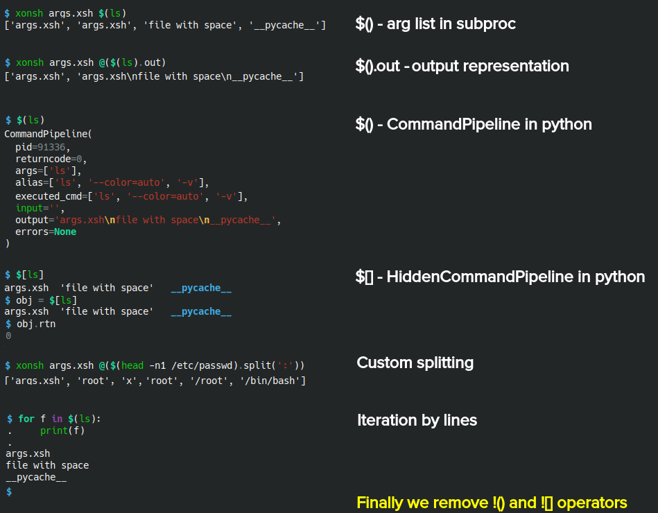

.. list-table::

  * - XEP:
    - 1
  * - Title:
    - Xonsh Operators Proposal
  * - Author:
    - anki-code
  * - Status:
    - Draft
  * - Created:
    - 2020-10-30
  * - Xonsh-Version:
    - 0.9.24

Motivation
**********

The first `command substitution <https://en.wikipedia.org/wiki/Command_substitution>`_ operator (now most known as ``$()``)
was created in 1979 and until nowadays it was used to split the one command output and push it as arguments to another command.

In xonsh the command substitution operator has the same syntax - ``$()`` - but in xonsh it returns the pure output from
one command to another. This behavior not well-known, not expected and leads to a constant need to ``strip``-ping
and ``split``-ting the output of the original command. This brings the syntax overhead to xonsh commands. This is unexpected
behavior for new users. And finally this blurs the difference between another xonsh operators.

The goal of this proposal is to suggest a new behavior for the command substitution operator and changes in another
operators to make the behavior more common and consistent and also with shortening the syntax overhead during usage
the command substitution operators.

This proposal have no goal to create exactly the same behavior and syntax as in previous shells in the shells history.
Also this proposal has no goal to support backwards compatibility exactly. The most use cases was designed with
maximization of backwards compatibility in mind but the operators in xonsh are located very close to the core
functionality and to achieve the real improvement of syntax and logic it requires move away from the backwards compatibility.

Approach
********

The idea is to merge ``!()`` and ``$()`` operators into one ``$()`` operator.

Quick examples
**************

Changes
*******

Operators changes:

.. list-table::
    :header-rows: 1

    * - Current
      - Proposed

    * - ``$()`` returns output string.
      - ``$()`` returns ``CommandPipeline`` object.

    * - ``$[]`` returns ``None``.
      - ``$[]`` returns ``HiddenCommandPipeline`` object.

    * - ``!()`` returns ``CommandPipeline``.
      - ``!()`` removed.

    * - ``![]`` returns ``HiddenCommandPipeline``.
      - ``![]`` removed.

``CommandPipeline`` (short ``CP``) class changes:

* Remove trailing new lines in `CP.lines``
* Add ``str`` representation as ``os.sep.join(CP.lines)``.
* Add ``str`` property to short access i.e. ``name = $(whoami).str``.
* Add ``lines(sep)`` method (IFS-alternative) to return the lines splitted by ``sep`` i.e. ``fields = $(head table.txt).lines('|')``.
* Add all string methods i.e. the ``$().find(txt)`` will return ``CP.str.find(txt)``.
* Add all string methods for lines i.e. ``$().lines_find(txt)`` will return ``[l.find(txt) for l in CP.lines]``.
* *Optionally*. Add ``words`` property to return the same as ``@$()`` and make alternative.
* *Optionally*. Add ``o`` property as shortcut to access to ``output``.

Git-branch with changes
***********************

To trying the changes install xonsh from branch:

.. code-block:: bash

    pip install -U git+https://github.com/anki-code/xonsh.git@xop-v2
    xonsh --no-rc

How will the use cases change
*****************************

The table of use cases compares the syntax of the current xonsh and the proposed.

`Switch the page to the better view <https://github.com/anki-code/xonsh-operators-proposal/blob/main/XEP-2.rst#how-will-the-use-cases-change>`_ for more comfortable reading the table:

.. list-table::
    :widths: 5 30 60
    :header-rows: 1

    * - Use case
      - Subproc current / proposed
      - Python current / proposed

    * - Get single argument.

        ✅ Becomes shorter.

      - ``id @($(whoami).rstrip())``
      
        ``id $(whoami)``
      - ``name = $(whoami).rstrip()``     
            
        ``name = $(whoami).str``
        
    * - Get multiple arguments.

        ✅ Becomes shorter.

      - ``du @($(ls).rstrip().split('\n'))``
      
        ``du $(ls)``
      - ``files = $(ls).rstrip().split('\n')``
            
        ``files = $(ls)``

    * - Get pure output.

        🔀️ More text.

      - ``echo -n $(curl https://xon.sh) | wc -c``
      
        ``echo -n @($(curl https://xon.sh).output) | wc -c``
      - ``html = $(curl https://xon.sh)``     
            
        ``html = $(curl https://xon.sh).output``

    * - Custom output splitting.

        🔀 Becomes clearer.

      - The similar as python mode.
      - ``shell = $(head -n1 /etc/passwd)[:-1].split(':').pop()``

        ``shell = $(head -n1 /etc/passwd).str.split(':').pop()``

    * - Apply string function to every line.

        ✅ Becomes shorter.

      - The similar as python mode.
      - ``lines = [l.strip() for l in $(ifconfig)[:-1].split('\n')]``

        ``lines = $(ifconfig).lines_strip()``

    * - ``grep`` single argument.

        ✅ Fix the bug.

      - ``cat /etc/passwd | grep $(whoami)``

        Wrong output of all lines in current version.

        One correct single line after update.

      - Not applicable.

Feel free to suggest your use cases.

Backwards compatibility
***********************

What will be broken after update:

.. list-table::
    :widths: 70 29
    :header-rows: 1

    * - Case
      - Fix

    * - Using ``!()`` or ``$[]``.

      - Replace to ``$()`` or ``$[]``.

    * - Functions that expect string but not convert the argument to string representation:

        ``json.loads($(curl https://api.github.com/orgs/xonsh))``

        TypeError: the JSON object must be str. List given.

      - Replace ``$()`` to ``!()`` or use ``$().str``.

    * - Using ``$()`` as string i.e. ``@(char for l in $(ls))``

      - Replace ``$()`` to ``$().str`` or ``$().output``.

What will not be broken after update:

* String function calls i.e. ``$(whoami).strip()``, ``$(ls).split('\n')``.
* Simple conditions i.e. `if $(date | grep 59):`

Questions
*********

1. From @scopatz: I think using $() in xonsh to split into a list of arguments is a neat idea,
   but it would necessitate the addition of some default or configurable way to split those arguments.
   For example, should $() be split by lines or by whitespace (like effectively what Bash does)?

   **Answer**: In this approach the complex splitting algorithm could be implemented with ``$().output`` or ``$().str``
   i.e. ``@($(head -n1 /etc/passw).str.split(':'))``.

3. From @scopatz: What happens with the other subprocess operators depending on their calling modes: ![], !(), $[]

   **Answer**: ``$[]`` return

4. From @scopatz: What do we do with the @$() operator? The initial idea for @$() what that you could register
   transformation functions (like a decorator), that would modify output. For example, @upper$() would uppercase
   the output. Or you could apply many times, like @split@upper(). Then what we have now would just be the default
   value: @split$() == @$(). However, this was never fully done, so maybe it is better to drop the syntax entirely.

   **Answer**: Probably we can replace it to something like ``@($().words)`` but it's new syntax overhead and
   new backwards compatibility issue. We'll think about dropping ``@$()`` on final stages of this proposal
   detalization.

Proposals to this proposal
**************************
There are two degrees of freedom:

* Setting different behavior of the operator in subproc and python mode.
* Returning the Python object from the operator that has an ability to return list or str representations and has any
  functions and properties.

Current proposal could be improved by suggestion with more optimal or useful properties of the objects that were returned by operators.
